<!-- ═══════════════════════════════════════════════════════════════ -->
<!--  ANIMATED SVG HEADER  (CSS animations embedded via SVG file)  -->
<!-- ═══════════════════════════════════════════════════════════════ -->
<p align="center">
  
</p>

<!-- ═══════════════════════════ TYPING SVG ════════════════════════ -->
<p align="center">
  
</p>

<!-- ═════════════════════════ PROFILE VIEWS + SOCIALS ════════════ -->
<p align="center">
  <a href="https://github.com/EV-OD">
    
  </a>
  &nbsp;
  <a href="https://lamichhanerabin.com.np">
    
  </a>
  &nbsp;
  <a href="https://www.linkedin.com/in/rabinlc01/">
    
  </a>
  &nbsp;
  <a href="https://x.com/RabinLc164">
    
  </a>
  &nbsp;
  <a href="https://dev.to/evod">
    
  </a>
  &nbsp;
  <a href="https://medium.com/@allwcons">
    
  </a>
</p>


<!-- ═════════════════════════════ ABOUT ══════════════════════════ -->
<br/>

<table>
<tr>
<td valign="top" width="55%">

### 👾 About Me

```
> whoami
  Rabin Lamichhane — Computer Engineer, Programmer
  & Web Enthusiast from Lalitpur, Nepal.

> cat manifesto.txt
  I might sound a little crazy, but I'm someone
  who has fallen in love with tech in all its forms.
  I build WebGL 3D apps AND 4-bit microprocessors.
  Whether it's high-level web magic or low-level
  hardware hacking — I build whatever I want. 🔥

> uname -a
  Linux LC-OS 2.5.0-generic x86_64 GNU/Linux
```

</td>
<td valign="top" width="45%">

### ⚡ Quick Facts

| | |
|---|---|
| 🎓 | B.E. Computer — IOE Pulchowk |
| 📍 | Lalitpur, Nepal |
| 🏛️ | IEEE Webmaster, Pulchowk SB |
| 🖥️ | Built a 32-bit OS kernel in C + x86 ASM |
| 🔌 | Designed a 4-bit CPU in Logisim |
| 🌐 | Full-stack + 3D web experiences |
| 🏆 | NASA Space Apps Challenge |
| 📧 | evod599@gmail.com |

</td>
</tr>
</table>

---

<!-- ══════════════════════════ TECH STACK ════════════════════════ -->

### 🛠️ Tech Stack

**Frontend**


**Backend & Runtimes**


**Low-level & Systems**


**Tools & Platforms**


---

<!-- ════════════════════════ FEATURED PROJECTS ═══════════════════ -->

### 🚀 Featured Projects

<details>
<summary><b>🖥️ RandomOS — 32-bit Operating System Kernel</b> &nbsp;<code>C · x86 Assembly · NASM · GRUB</code></summary>
<br/>

> An experimental 32-bit OS kernel written in C and x86 Assembly. Features a higher-half kernel with paging, interrupt handling, FAT32 filesystem, CFS multitasking scheduler, VESA GUI subsystem, and a fully native compiler (**rosc**) for the RandomOS Language (`.ros`) that produces ring-3 user-mode executables at runtime.

**Status:** 🟡 Ongoing &nbsp; | &nbsp; 📂 [View on GitHub](https://github.com/EV-OD/os)

</details>

<details>
<summary><b>🔌 4-Bit Microprocessor</b> &nbsp;<code>Logisim-Evolution · Digital Logic</code></summary>
<br/>

> A complete 4-bit CPU designed in Logisim-Evolution. Minimalist and educational by design — ideal for understanding how computation works at the transistor level.

**Status:** ✅ Completed &nbsp; | &nbsp; 📂 [View on GitHub](https://github.com/EV-OD/4bit_computer)

</details>

<details>
<summary><b>⚡ CircuitFlow — AI + SPICE in the Browser</b> &nbsp;<code>React · WebAssembly · NGSPICE · Gemini</code></summary>
<br/>

> "Google Maps for Electronics." Uses Gemini's reasoning with an industrial-grade SPICE physics simulator (via WebAssembly) running in the browser to design functional schematics from natural language prompts.

**Status:** 🟡 Ongoing &nbsp; | &nbsp; 📂 [GitHub](https://github.com/EV-OD/circuitflow) &nbsp; | &nbsp; 🎥 [Demo](https://www.youtube.com/watch?v=H_MoL6nBAdA)

</details>

<details>
<summary><b>🔧 @allwcons/vite-plugin-jsw — WASM from TypeScript</b> &nbsp;<code>TypeScript · Vite · AssemblyScript</code></summary>
<br/>

> A Vite plugin enabling high-performance WebAssembly compilation from TypeScript-like syntax using the `use wasm` directive. Handles type inference and auto-i32 index casting.

**Status:** 🟡 Ongoing &nbsp; | &nbsp; 📂 [GitHub](https://github.com/EV-OD/vite-plugin-jsw) &nbsp; | &nbsp; 📦 [npm](https://www.npmjs.com/package/@allwcons/vite-plugin-jsw)

</details>

<details>
<summary><b>🤖 SnapRun — Windows Automation with Rhai Scripting</b> &nbsp;<code>Rust · Tauri v2 · SolidJS</code></summary>
<br/>

> A Windows automation tool that simplifies workflows through Rhai scripting. Features global shortcuts, markdown rendering, and comprehensive file system APIs for productivity.

**Status:** 🟡 Ongoing &nbsp; | &nbsp; 📂 [View on GitHub](https://github.com/EV-OD/winscript)

</details>

<details>
<summary><b>🌌 Celestial Odyssey — 3D Solar System Explorer</b> &nbsp;<code>React · Three.js · Python</code></summary>
<br/>

> Interactive 3D exploration of the solar system with immersive planet tours, detailed planetary data, sound effects, and an AI guide. Built for the NASA Space Apps Challenge 2023.

**Status:** ✅ Completed &nbsp; | &nbsp; 📂 [View on GitHub](https://github.com/clerisy47/Celestial-Odyssey)

</details>

<details>
<summary><b>⚙️ Digisim — Digital Logic Simulator</b> &nbsp;<code>C++ · Gtkmm 4</code></summary>
<br/>

> A full digital logic simulator built with C++ and Gtkmm 4 for educational purposes. Supports custom chip design and complex circuit simulation.

**Status:** ✅ Completed &nbsp; | &nbsp; 📂 [GitHub](https://github.com/EV-OD/Digital-Logic) &nbsp; | &nbsp; 🌐 [Website](https://ev-od.github.io/DigiSem-WebSite/)

</details>

<details>
<summary><b>✏️ VectorMate JS — Web-Based Vector Editor</b> &nbsp;<code>React · TypeScript · Canvas</code></summary>
<br/>

> A powerful browser-based vector editor with infinite canvas, pan/zoom, boolean shape operations, snapping, and extensive keyboard shortcuts.

**Status:** ✅ Completed &nbsp; | &nbsp; 📂 [GitHub](https://github.com/EV-OD/vectormate_js_version) &nbsp; | &nbsp; 🌐 [Live](https://ev-od.github.io/vectormate_js_version/)

</details>

<details>
<summary><b>📐 Shaper — 3D Geometry Node Editor</b> &nbsp;<code>React · Three.js · Node.js</code></summary>
<br/>

> A web-based application for creating and manipulating geometry nodes. Provides an intuitive interface for designing complex geometric shapes directly in the browser.

**Status:** ✅ Completed &nbsp; | &nbsp; 📂 [GitHub](https://github.com/EV-OD/shaper) &nbsp; | &nbsp; 🌐 [Live](https://ev-od.github.io/shaper/)

</details>

<details>
<summary><b>📚 More Projects...</b></summary>
<br/>

| Project | Description | Stack | Status |
|---|---|---|---|
| [Acss](https://github.com/EV-OD/acss) | CSS Engine with if-else logic and browser runtime events | Node.js, JS | ✅ |
| [Wcons CLI](https://github.com/EV-OD/wcons) | Customizable CLI with extensible commands & cross-platform support | Python | ✅ |
| [NyayaPrep](https://github.com/EV-OD/nyayaprep) | BALLB prep MCQ platform with translation & subscription management | Next.js, Firebase | 🟡 |
| [Nepal Driving License Exam](https://github.com/EV-OD/License-test) | Free mock test app for Nepal's driving license exam | Next.js, Tailwind | 🟡 |
| [Pattern Generator](https://github.com/EV-OD/react-pattern-generator) | Web-based pattern generator with shapes, colors & styles | React, TS | ✅ |
| [Graph Plotter in C](https://github.com/bct2079/graphzier) | Visualize mathematical functions using Cairo graphics | C, Cairo | ✅ |

</details>

---

<!-- ════════════════════════ GITHUB STATS ════════════════════════ -->

### 📊 GitHub Stats

<p align="center">
  
  &nbsp;
  
</p>

<p align="center">
  
</p>

<!-- ═══════════════════════════ TROPHIES ══════════════════════════ -->

<p align="center">
  
</p>

<!-- ═══════════════════════ ACTIVITY GRAPH ════════════════════════ -->

<p align="center">
  
</p>

<!-- ═══════════════════════ CONTRIBUTION SNAKE ════════════════════ -->

<p align="center">
  <picture>
    <source media="(prefers-color-scheme: dark)" srcset="https://raw.githubusercontent.com/EV-OD/EV-OD/output/github-contribution-grid-snake-dark.svg"/>
    <source media="(prefers-color-scheme: light)" srcset="https://raw.githubusercontent.com/EV-OD/EV-OD/output/github-contribution-grid-snake.svg"/>
    
  </picture>
</p>

---

<!-- ═══════════════════════════ BLOG ══════════════════════════════ -->

### 📝 Latest Articles

- [Memory Management in Web Development](https://medium.com/@allwcons/memory-management-in-web-development-171f951ef765) — *Medium*

---

<!-- ═══════════════════════════ CONTACT ══════════════════════════ -->

### 📡 Connect

<p align="center">
  <a href="mailto:evod599@gmail.com"></a>
  &nbsp;
  <a href="mailto:rabin@ieee.org"></a>
  &nbsp;
  <a href="https://lamichhanerabin.com.np"></a>
  &nbsp;
  <a href="https://www.linkedin.com/in/rabinlc01/"></a>
  &nbsp;
  <a href="https://x.com/RabinLc164"></a>
</p>

<p align="center">
  <i>"I might sound a little crazy, but I'm someone who has fallen in love with tech."</i><br/>
  <sub>— Rabin Lamichhane</sub>
</p>
